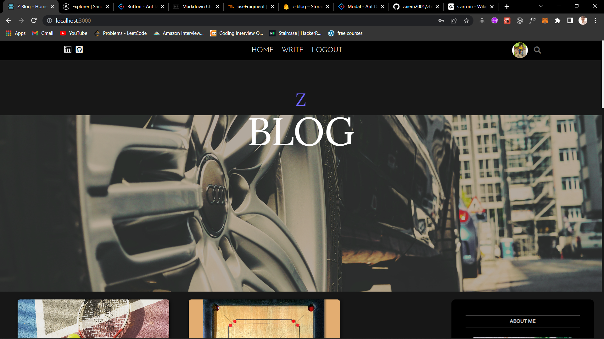
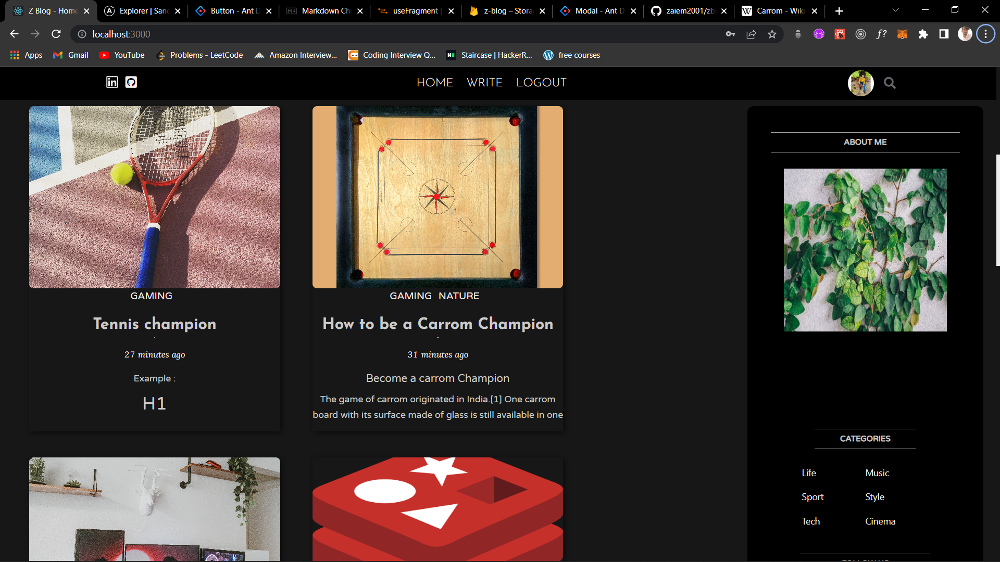
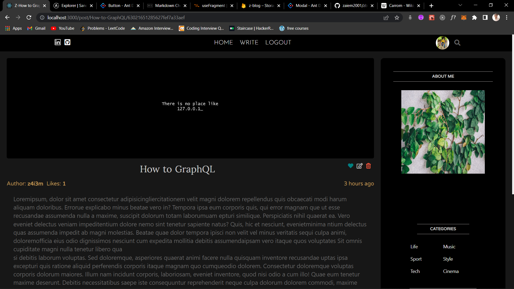
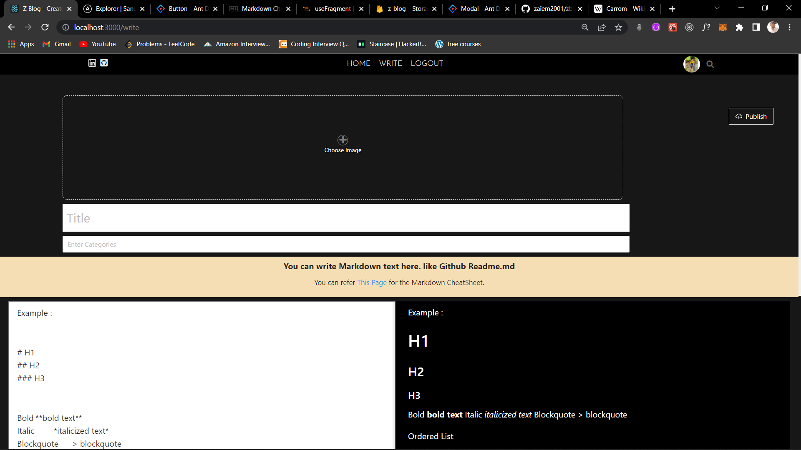
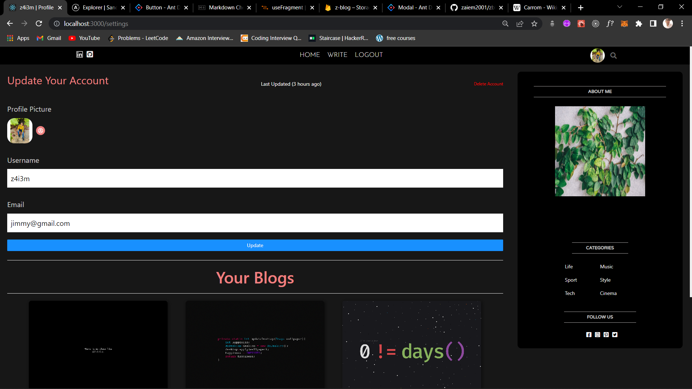

### Z-blog app Frontend Repo.

#### To run this app in your local Machine.

**Note**: `Typescript` must be installed in your system.

- `$ git clone repo url`
- `$ npm install` (in this project directory)
- `$ npm start`

 

- `React relay` is used for frontend graphQL requests.
- After running the app relay will create `__generated__` folder.
- Relay will compile all your **Queries** and **Mutations** into `__generated__` folder, it is very helpful as if there is any error, `relay compiler` will throw an error so we can avoid `runtime` errors.

 

- When creating a **Blog** you can write **Markdown** text like `github Readme.md` and it will reflect in the blog.
- `React Markdown` is used for rendering the Markdown text.

 

- Everytime when you change your schenma or add new **Queries**, **Fragments** or **Mutations** in the Frontend or Server side, you must run the **relay compiler**.
- There is a script in `package.json` file, `$npm run compile` which will update your schema and relay will compile all your Graphql queries.

---

- **Firebase** is used for image storage.
- create a firebase app in your **firebase console**.
- There is a file `firebase.ts` in the `config` folder, where you have to store your `firebase config`
- Go to your [firebase console](https://console.firebase.google.com) and replace the `firebaseConfig` object with yours.

**Note**: My Config file will not work in your machine as i've restricted the access.

- You will have to create `images` folder into your firebase app storage settings.
- in `rules` you have to set **read** and **write** to `true`.

---

### Some screenshots of the app

- This app is not deployed yet.

- **Home Page**
  
  

 

- **Blog Details** with `like` and `comment` Mutation
  

 

- Create a blog with **Markdown** text like `Github Readme.md`
  

 

- Profile Page with **Image** update.
  
